<p align="center">
  <picture>
    <source media="(prefers-reduced-motion: reduce)" srcset="assets/hero/hero-reduced.svg">
    <source media="(prefers-color-scheme: light)" srcset="assets/hero/hero-light.svg">
    
  </picture>
</p>

<p align="center">
  <picture>
    <source media="(prefers-reduced-motion: reduce)" srcset="assets/hero/computational-dark.svg">
    <source media="(prefers-color-scheme: light)" srcset="assets/hero/computational-light.svg">
    
  </picture>
</p>

## Full of Shit

Premium Next.js + TypeScript + Tailwind site + MVP demo for **Full of Shit** — a startup reality engine that brutally tells founders whether an idea is real, redundant, missing a buyer, missing pain, missing a wedge, or simply a time sink.

## Getting Started

### Run locally (pnpm only)

```bash
cd /Users/joshuadavis/startups/fullofshit
pnpm install
pnpm dev
```

Open `http://localhost:3000`.

### Build

```bash
pnpm build
pnpm start
```

## MVP notes

- **No auth**
- **No database**
- **No external APIs**
- Analyzer logic lives in `src/lib/analyze.ts` and runs locally (deterministic heuristics).

## Manual deploy (founder)

```bash
cd /Users/joshuadavis/startups/fullofshit
pnpm install
pnpm build
vercel --prod
```

## Autobuilder

Foundation + guardrails live in:

- `RECOVERY_NOTES.md`
- `AUTOBUILDER_FOUNDATION.json`
- `.autobuilder/project-state.json`
- `.autobuilder/next-actions.json`
- `.autobuilder/guardrails.md`
